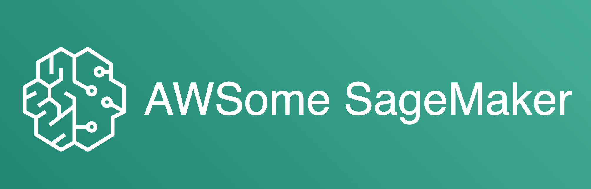

# Awesome SageMaker

## What is SageMaker?
Amazon SageMaker is a fully managed service to build, train, and deploy machine learning (ML) models for any use case with fully managed infrastructure, tools, and workflows.

More info [here](https://www.youtube.com/watch?v=Qv_Tr_BCFCQ).

## Table of Contents
| <!-- -->                                      | <!-- -->                        |
|-----------------------------------------------|---------------------------------|
| [Getting Started](#getting-started)           | [Free Courses](#free-courses)   |
| [Core Functionalities](#core-functionalities) | [Community](#community)         |
| [Machine Learning Domains](#ml-domains)       | [Books](#books)                 |
| [Advanced Topics](#advanced-topics)           | [News](#news)                   |
| [Security & Enterprise](#security-enterprise) | [Contributions](#contributions) |

## Getting Started
- [SageMaker Example Notebooks](https://sagemaker-examples.readthedocs.io/en/latest/)
- [Amazon SageMaker 101 Workshop](https://catalog.us-east-1.prod.workshops.aws/workshops/0c6b8a23-b837-4e0f-b2e2-4a3ffd7d645b/en-US)
- [SageMaker Immersion Day (hands-on labs)](https://catalog.us-east-1.prod.workshops.aws/workshops/63069e26-921c-4ce1-9cc7-dd882ff62575/en-US)

## Core Functionalities
- **Developer Experience**
  - [Onboard Quickly to Amazon SageMaker Studio](https://www.youtube.com/watch?v=wiDHCWVrjCU)
  - [Hosting VS Code on SageMaker](https://towardsdatascience.com/hosting-vs-code-in-sagemaker-studio-f211385e25f7)
  - [Using RStudio on SageMaker](https://www.rstudio.com/sagemaker/)
- **Tools/Utilities**
  - [SageMaker Python SDK](https://sagemaker.readthedocs.io/en/stable/)
  - [Boto3](https://boto3.amazonaws.com/v1/documentation/api/latest/reference/services/sagemaker.html)
- **Containers/Frameworks**
  - [Supported pre-built containers/frameworks (script mode)](https://sagemaker.readthedocs.io/en/stable/frameworks/index.html)
  - [Using Script Mode with Amazon SageMaker](https://www.youtube.com/watch?v=x94hpOmKtXM)
  - [Using custom training containers](https://github.com/aws/amazon-sagemaker-examples/tree/main/advanced_functionality/custom-training-containers)
  - [Training toolkit](https://github.com/aws/sagemaker-training-toolkit) and [Inference toolkit](https://github.com/aws/sagemaker-inference-toolkit)
- **Jobs**
  - [SageMaker Processing](https://sagemaker.readthedocs.io/en/stable/amazon_sagemaker_processing.html#amazon-sagemaker-processing)
  - [Local mode](https://github.com/aws-samples/amazon-sagemaker-local-mode)
  - [Debugging with Tensorboard](https://google.fr/)
- **Inference**
  - [Running Triton Inference Server with Amazon SageMaker](https://www.coursera.org/lecture/machine-learning-aws-nvidia/running-triton-inference-server-with-amazon-sagemaker-HwIki)

## Machine Learning Domains
- **Data Labeling**
  - [Introducing Amazon SageMaker Ground Truth Plus](https://www.youtube.com/watch?v=Y3Lo63yiqsU)
  - [Labeling data with Label Studio on SageMaker](https://medium.com/geekculture/labeling-data-with-label-studio-on-sagemaker-e4b2d1b562f7)
- **MLOps**
  - SageMaker Pipelines
    - [Introducing Amazon SageMaker Pipelines](https://www.youtube.com/watch?v=Hvz2GGU3Z8g)
    - [Building, automating, managing, and scaling ML workflows using Amazon SageMaker Pipelines](https://aws.amazon.com/blogs/machine-learning/building-automating-managing-and-scaling-ml-workflows-using-amazon-sagemaker-pipelines/)
    - [MLOps with MLFlow and Amazon SageMaker Pipelines](https://towardsdatascience.com/mlops-with-mlflow-and-amazon-sagemaker-pipelines-33e13d43f238)
    - [Scaling MLOps with resilient pipelines](https://towardsdatascience.com/i-tried-scaling-sagemaker-pipeline-executions-and-this-happened-31279b92821e)
  - Model Registry
  - Best Practices
    - [MLOps foundation roadmap for enterprises with Amazon SageMaker](https://aws.amazon.com/blogs/machine-learning/mlops-foundation-roadmap-for-enterprises-with-amazon-sagemaker/)
- **Computer Vision**
  - [Training and deploying models using TensorFlow 2 with the Object Detection API on Amazon SageMaker](https://aws.amazon.com/blogs/machine-learning/training-and-deploying-models-using-tensorflow-2-with-the-object-detection-api-on-amazon-sagemaker/)
  - [Object detection with Detectron2 on Amazon SageMaker](https://aws.amazon.com/blogs/machine-learning/object-detection-with-detectron2-on-amazon-sagemaker/)
- **Natural Language Processing**
  - [Hugging Face on Amazon SageMaker](https://huggingface.co/docs/sagemaker/main)
- **Auto-ML**
  - [link 1](https://google.fr/)
- **Low-Code/No-Code**
  - [Amazon SageMaker Canvas - Generate accurate ML Predictions - No Code Required](https://www.youtube.com/watch?v=Sy3GDQT6Lnk)
  - [Canvas Immersion Day](https://catalog.us-east-1.prod.workshops.aws/workshops/80ba0ea5-7cf9-4b8c-9d3f-1cd988b6c071/en-US)

## Advanced Topics
- **Large Scale Data Processing**
  - [Using Apache Spark on Amazon EMR with SageMaker](https://www.youtube.com/watch?v=RxRENYQBxZU)
  - [Spark in Processing Jobs](https://sagemaker.readthedocs.io/en/stable/amazon_sagemaker_processing.html#data-processing-with-spark)
- **Distributed Training**
  - [Choose the best data source for your Amazon SageMaker training job](https://aws.amazon.com/blogs/machine-learning/choose-the-best-data-source-for-your-amazon-sagemaker-training-job/)
  - [link 2](https://google.fr/)
- **Hardware Acceleration**
  - [link 1](https://google.fr/)
  - [link 2](https://google.fr/)
- **Model Monitoring & Bias Detection**
  - [link 1](https://google.fr/)
  - [link 2](https://google.fr/)
- **Edge Deployments**
  - [link 1](https://google.fr/)
  - [link 2](https://google.fr/)
- **Feature Store**
  - [link 1](https://google.fr/)
  - [link 2](https://google.fr/)

## Security & Enterprise
- **Security**
- **Cost Control & Tracking**
- **ML Platform Setup**
  - [Setting up secure, well-governed machine learning environments on AWS](https://aws.amazon.com/blogs/mt/setting-up-machine-learning-environments-aws/)
  - [Enabling self-service provisioning of Amazon SageMaker Studio resources](https://towardsdatascience.com/enabling-self-service-provisioning-of-amazon-sagemaker-studio-resources-7ac017925016)
  - [Industrializing an ML platform with Amazon SageMaker Studio](https://towardsdatascience.com/industrializing-an-ml-platform-with-amazon-sagemaker-studio-91b597802afe)
  - [Scaling Enterprise ML Platforms with Modern Cloud Operations](https://towardsdatascience.com/scaling-enterprise-mlops-delivery-with-modern-cloud-operations-6888d7218be5)

## Free Courses
- [Getting Started with AWS Machine Learning](https://www.coursera.org/learn/aws-machine-learning)
- [Practical Data Science on the AWS Cloud Specialization](https://www.coursera.org/specializations/practical-data-science)
- [AWS hands-on tutorials](https://aws.amazon.com/getting-started/hands-on/?getting-started-all.sort-by=item.additionalFields.sortOrder&getting-started-all.sort-order=asc&awsf.getting-started-category=category%23machine-learning&awsf.getting-started-level=*all&awsf.getting-started-content-type=*all)
- [Machine Learning University](https://aws.amazon.com/machine-learning/mlu/)

## Community
- [Amazon SageMaker Fridays](https://pages.awscloud.com/SageMakerFridays)
- [AWS Machine Learning Blog](https://aws.amazon.com/blogs/machine-learning/category/artificial-intelligence/sagemaker/)
- [AWS events](https://aws.amazon.com/events/)
- [AWS re:Post](https://repost.aws/)
- [Stack Overflow](https://stackoverflow.com/questions/tagged/amazon-sagemaker)

## Books
- [Learn Amazon SageMaker: A guide to building, training, and deploying machine learning models for developers and data scientists, 2nd Edition](https://www.amazon.co.uk/Learn-Amazon-SageMaker-developers-scientists/dp/1801817952/ref=sr_1_1?crid=1BK45HRK8T7SE&keywords=sagemaker&qid=1657373160&sprefix=sagemake%2Caps%2C235&sr=8-1)

## News
- [What's New with Machine Learning?](https://aws.amazon.com/about-aws/whats-new/machine-learning/?whats-new-content.sort-by=item.additionalFields.postDateTime&whats-new-content.sort-order=desc&awsf.whats-new-products=general-products%23amazon-sagemaker)

- 
## Contributions
Maintainers: [Sofian Hamiti](https://github.com/SofianHamiti)